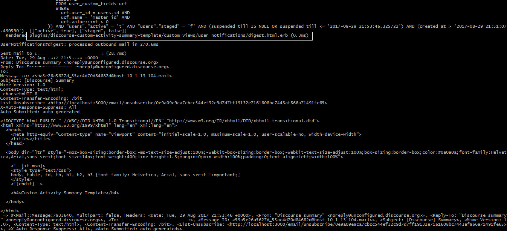
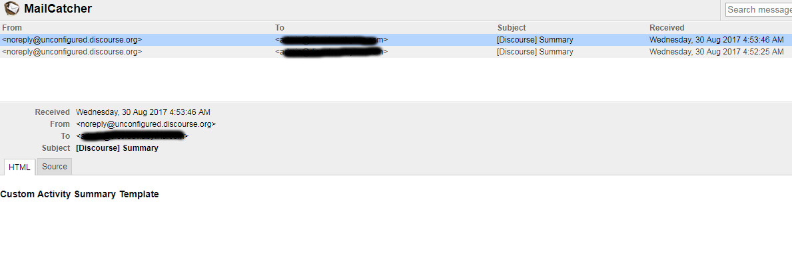
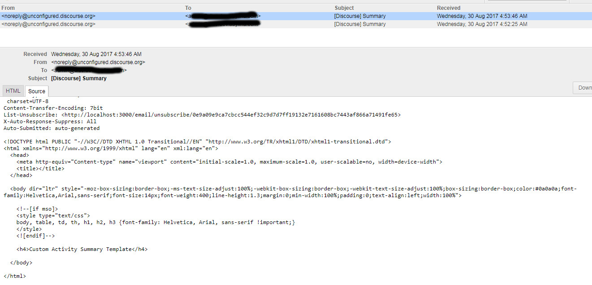

# Discourse Custom Activity Summary Template

An example plugin to override default Discourse's Activity Summary (digest) email template.

The main purpose of this plugin is to show how to override default `.erb` templates on Discourse.

## Screenshot

